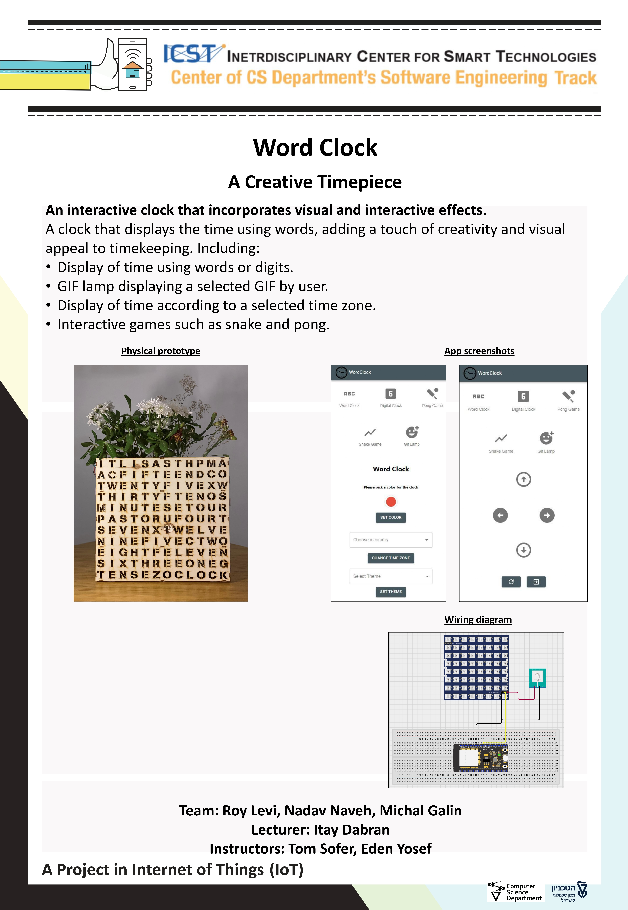

# Word Clock Project

## Overview
Welcome to the README file for the Word Clock project, an exciting and innovative endeavor developed by our talented team during our IoT course. Our goal was to reimagine the way we perceive time and create a unique timekeeping experience. By combining the power of frontend development with React.js and the versatility of backend implementation with Python and FastAPI middleware, we have brought the Word Clock to life.

## Features
The Word Clock is packed with an impressive array of features that will transform the way you view time. Here's a closer look at what it offers:

### Word and Digit Display
Seamlessly presenting the time using both words and digits, the Word Clock ensures optimal readability and allows you to choose the display format that suits your preference.

### Time Zone Customization
Effortlessly switch between time zones and easily synchronize with different global timeframes. Stay connected with friends, family, or colleagues around the world without missing a beat.

### Dynamic Color Change
Personalize your clock's appearance by choosing from a captivating array of colors. Match your clock to your mood, room decor, or simply create a visually engaging experience.

### Holiday-Themed Color Presets
Celebrate cultural diversity and embrace the spirit of special occasions with preset color themes inspired by Christian, Muslim, and Jewish holidays. Infuse your space with a festive atmosphere all year round.

### Gaming Fun
Take a break from timekeeping and indulge in classic Snake and Pong games. These delightful additions provide a moment of entertainment whenever you need a brief escape.

### GIF Lamp Integration
Elevate the visual appeal of your Word Clock by loading and displaying captivating GIFs. Transform your clock into an enchanting lamp, creating a mesmerizing ambiance in any room.

## Team Collaboration
The Word Clock is the result of the dedicated collaboration between our talented team members, Nadav Naveh, Michal Galin, and Roy Levi. Through our combined skills, expertise, and shared vision, we have successfully brought this extraordinary project to life.

## Project Significance
The Word Clock represents our deep dive into the fascinating landscape of IoT. It serves as a testament to our passion for innovation and our drive to push boundaries. Through this project, we have explored new possibilities, challenged traditional concepts, and fostered an environment of continuous learning and growth. We take immense pride in the implementation of the Word Clock and the unique experiences it offers to users.

## Contact Information
If you are interested in learning more about our project or have any inquiries, please feel free to reach out to us. We would be delighted to share further insights, provide detailed explanations, and discuss our experiences throughout the development process.

## Folder Description
- `esp-word-clock`: This directory contains all the relevant files for the ESP32 functionality, enabling seamless integration and control of the Word Clock.
- `tests`: Inside this folder, you will find comprehensive tests for the backend Python server. We have rigorously tested the functionality to ensure a reliable and robust performance.
- `word-clock-app`: This folder encompasses the web application that powers the Word Clock. It has been meticulously crafted using React.js, delivering a seamless and immersive user experience.
- `word-clock-server`: The backend server, written in Python with FastAPI as the middleware, resides in this folder. It forms the backbone of the Word Clock system, facilitating efficient communication and handling various requests.

## Arduino/ESP32 libraries used in this project:
- `Adafruit_NeoPixel` : 1.11.0

## Project's poster:

